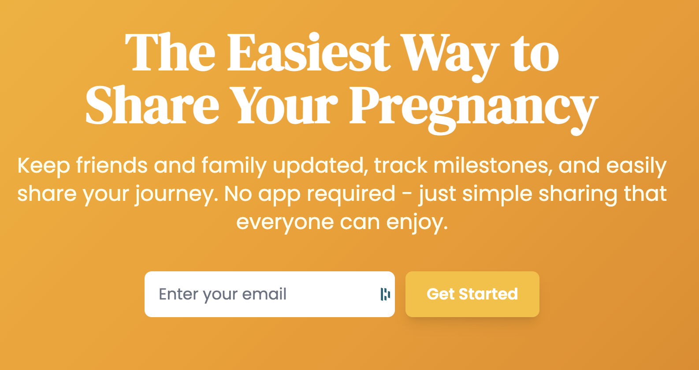

# 40 Weeks - Pregnancy Journey Tracker

<p align="center">
  
</p>

<p align="center">
  <strong>The easiest way to share your pregnancy journey with loved ones.</strong><br>
  Keep friends and family updated with photos, milestones, and weekly progress - no app downloads required.
</p>

---

A comprehensive web application for tracking and sharing pregnancy journeys with family and friends. Built with Go, featuring a modern UI with Tailwind CSS, JWT authentication, SQLite database for data storage, AWS SES for email notifications, and support for photo/video uploads.

## Features

### Core Features
- **Pregnancy Timeline**: Track week-by-week pregnancy progress with updates and photos
- **Village Members**: Share your journey with family and friends who can view updates
- **Media Support**: Upload and manage photos and videos for each update
- **Mobile Responsive**: Beautiful, modern UI that works on all devices
- **Secure Authentication**: JWT-based authentication with role management

### Email Notifications
- **Automated Updates**: Village members receive beautiful HTML emails for new updates
- **Welcome Emails**: New village members get onboarded with a welcome email
- **Milestone Notifications**: Celebrate important pregnancy milestones
- **AWS SES Integration**: Reliable email delivery with tracking

### Technical Features
- **Single Binary**: Go HTTP service serving both API and frontend
- **SQLite Database**: Lightweight database with automated migrations
- **Docker Support**: Easy deployment with Docker Compose
- **Health Monitoring**: Built-in health check endpoints
- **CORS Support**: API can be consumed by external clients

## Quick Start with Docker (Recommended)

### Prerequisites
- Docker and Docker Compose installed
- AWS SES credentials (optional, for email notifications)

### Steps

1. Clone the repository:
```bash
git clone https://github.com/yourusername/40-weeks.git
cd 40-weeks
```

2. Create environment file:
```bash
cp api/.env.example api/.env
# Edit api/.env with your configuration
```

3. Start the service:
```bash
docker compose up -d
```

4. Access the application:
- Web Interface: http://localhost:8081
- Health Check: http://localhost:8081/health
- Demo credentials: `admin` / `password`

5. View logs:
```bash
docker compose logs -f simple-go
```

## Running Locally (Development)

### Prerequisites
- Go 1.20 or higher
- SQLite3

### Steps

1. Install dependencies:
```bash
cd api
go mod download
```

2. Set up environment:
```bash
cp .env.example .env
# Edit .env with your configuration
```

3. Run database migrations:
```bash
./migrate.sh up
```

4. Start the service:
```bash
go run main.go
```

The service will start on port 8080.

## Configuration

### Environment Variables

#### Core Configuration
| Variable | Default | Description |
|----------|---------|-------------|
| `PORT` | `8080` | Server port |
| `JWT_SECRET` | `your-secret-key-change-this` | JWT signing key (MUST CHANGE) |
| `DATABASE_URL` | `./data/sqlite/core.db` | SQLite database file path |
| `BASE_URL` | `http://localhost:8080` | Base URL for emails and links |

#### Media Storage
| Variable | Default | Description |
|----------|---------|-------------|
| `IMAGES_DIRECTORY` | `./data/images` | Directory for uploaded images |
| `VIDEOS_DIRECTORY` | `./data/videos` | Directory for uploaded videos |

#### Email Configuration (AWS SES)
| Variable | Default | Description |
|----------|---------|-------------|
| `EMAIL_ENABLED` | `false` | Enable email notifications |
| `AWS_REGION` | `us-east-1` | AWS region for SES |
| `AWS_ACCESS_KEY_ID` | - | AWS access key (required if email enabled) |
| `AWS_SECRET_ACCESS_KEY` | - | AWS secret key (required if email enabled) |
| `SENDER_EMAIL` | `noreply@example.com` | From email address (must be verified in SES) |
| `SENDER_NAME` | `40Weeks` | From name in emails |

## API Documentation

### Authentication Endpoints
- `POST /api/login` - User login
- `POST /api/register` - User registration
- `GET /api/profile` - Get current user profile (requires auth)

### Pregnancy Management
- `POST /api/pregnancies` - Create new pregnancy
- `GET /api/pregnancies` - List user's pregnancies
- `GET /api/pregnancies/:id` - Get pregnancy details
- `PUT /api/pregnancies/:id` - Update pregnancy
- `DELETE /api/pregnancies/:id` - Delete pregnancy

### Timeline & Updates
- `GET /api/pregnancies/:id/timeline` - Get pregnancy timeline
- `GET /api/timeline/:code` - Get shared timeline (no auth required)
- `POST /api/updates` - Create new update
- `GET /api/updates/:id` - Get update details
- `PUT /api/updates/:id` - Update an update
- `DELETE /api/updates/:id` - Delete update

### Village Members
- `GET /api/pregnancies/:id/village` - List village members
- `POST /api/pregnancies/:id/village` - Add village member
- `DELETE /api/pregnancies/:id/village/:memberId` - Remove village member

### Media Upload
- `POST /api/media/upload` - Upload image or video
- `GET /api/media/:type/:filename` - Retrieve media file
- `DELETE /api/media/:id` - Delete media file

### Email Notifications
- `GET /api/email/config-test` - Test email configuration
- `POST /api/email/test` - Send test email
- `GET /api/email/notifications` - Get notification history
- `GET /api/email/statistics` - Email delivery statistics

## Email Notification System

The application includes a comprehensive email notification system powered by AWS SES:

### Setup AWS SES
1. Verify your domain or email address in AWS SES
2. Request production access if sending to unverified emails  
3. Create IAM user with SES send permissions
4. Add AWS credentials to your environment

### Email Features
- **Update Notifications**: Automatically sent when new updates are posted
- **Welcome Emails**: Sent to new village members
- **Professional Templates**: Beautiful, responsive HTML emails
- **Delivery Tracking**: Monitor email delivery status

### Development Mode
When `EMAIL_ENABLED=false`, emails are logged but not sent, making development safe.

## Database Schema

### Main Tables
- `users`: User accounts with authentication
- `pregnancies`: Pregnancy records with due dates and settings
- `updates`: Timeline updates with content and media
- `village_members`: Family and friends with view access
- `media`: Uploaded photos and videos
- `email_notifications`: Email delivery tracking

### Migrations
Database migrations are managed with golang-migrate:

```bash
# Run all pending migrations
cd api && ./migrate.sh up

# Rollback last migration
./migrate.sh down

# Check migration status
./migrate.sh status

# Create new migration
./migrate.sh create "description"
```

## Frontend Architecture

- **Tailwind CSS**: Modern utility-first CSS framework
- **shadcn/ui Inspired**: Clean component design system
- **Vanilla JavaScript**: No build step required
- **Mobile First**: Responsive design for all screen sizes

## Development Guide

### Project Structure
```
40-weeks/
├── api/
│   ├── main.go           # Application entry point
│   ├── config/           # Configuration management
│   ├── db/              # Database layer and migrations
│   ├── middleware/      # JWT auth and CORS
│   ├── routes/          # HTTP route handlers
│   ├── services/        # Business logic (email, etc)
│   └── public/          # Frontend HTML/CSS/JS
├── docker-compose.yml   # Docker composition
├── Dockerfile          # Multi-stage build
└── README.md          # This file
```

### Making Changes
1. Backend changes: Edit Go files in `api/`
2. Frontend changes: Edit files in `api/public/`
3. Database changes: Create new migration with `./migrate.sh create`
4. Test locally before committing

### Code Style
- Go: Follow standard Go conventions
- Frontend: Use Tailwind classes, avoid custom CSS
- Git: Conventional commits (feat:, fix:, docs:, etc)

## Deployment

### Using Docker Compose (Recommended)
```bash
# Production deployment
docker compose -f docker-compose.yml up -d
```

### Manual Deployment
1. Build the binary:
```bash
cd api && go build -o 40weeks main.go
```

2. Run migrations:
```bash
./migrate.sh up
```

3. Start the service:
```bash
./40weeks
```

### Environment Considerations
- Set strong `JWT_SECRET` in production
- Use HTTPS with a reverse proxy (nginx, Caddy)
- Configure AWS SES for production email delivery
- Set up regular database backups
- Monitor disk space for media uploads

## Security Considerations

- **Authentication**: JWT tokens with configurable expiration
- **Password Storage**: bcrypt hashing with salt
- **File Uploads**: Validated and sanitized filenames
- **SQL Injection**: Prevented using parameterized queries
- **XSS Protection**: Input sanitization and output encoding
- **CORS**: Configurable cross-origin policies

## Contributing

Contributions are welcome! Please:

1. Fork the repository
2. Create a feature branch
3. Make your changes
4. Add tests if applicable
5. Submit a pull request

## License

MIT License - see [LICENSE](LICENSE) file for details.

## Acknowledgments

- Built with Go and Tailwind CSS
- Email delivery powered by AWS SES
- UI inspired by shadcn/ui design system